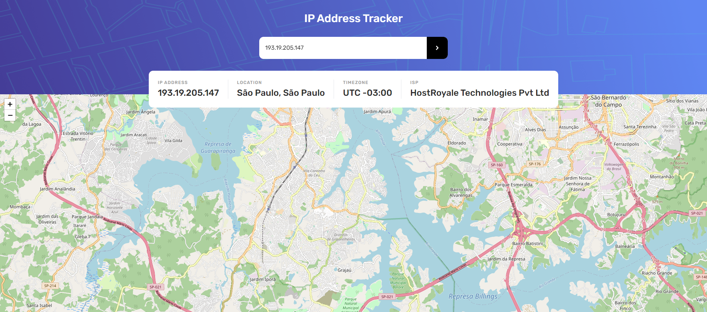
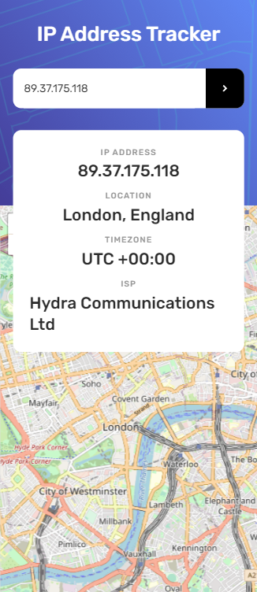

# Frontend Mentor - Ip Address Tracker

This is a solution to the Ip Address Tracker. Frontend Mentor challenges help you improve your coding skills by building realistic projects.

## Table of contents

- [Overview](#overview)
  - [The challenge](#the-challenge)
  - [Screenshot](#screenshot)
  - [Links](#links)
- [My process](#my-process)
  - [Built with](#built-with)
- [Author](#author)

## Overview

### The challenge

Users should be able to:

- See their own IP Address on the map on the initial page load
- Search for any IP addresses or domains and see the key information and location
- View the optimal layout for each page depending on their device's screen size
- See hover states for all interactive elements on the page

### Screenshot

  
  

### Links

- [Live Site]()

## My process

### Built with

- [React](https://reactjs.org/) - JS library
- [Tailwindcss](https://tailwindcss.com/) - For styles
- Typescript
- Mobile First
- Axios
- [LeafletJS](https://leafletjs.com/)
- [IP Geolocation API](https://geo.ipify.org/)

## Author

- Frontend Mentor - [@yan-batista](https://www.frontendmentor.io/profile/yan-batista-1326)
- Github - [@yan-batista](https://github.com/yan-batista)
